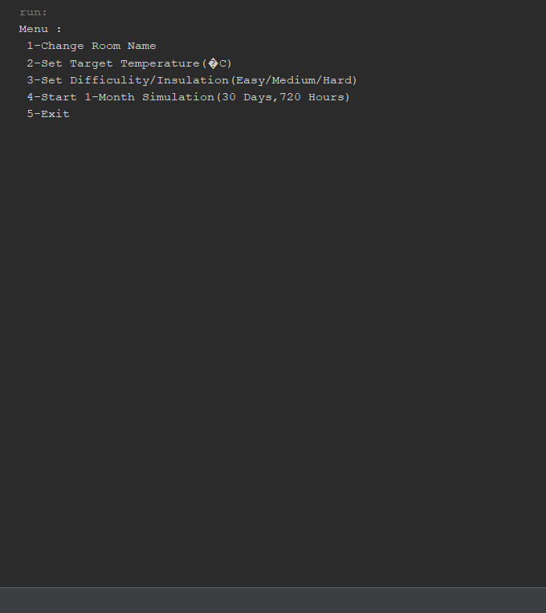

# java-thermostat-simulation
Simple thermostat simulation written in Java. Demonstrates temperature control logic and object-oriented programming concepts.
## Screenshot

## Use Cases
This project can be adapted for:
- Programming assignments
- Student projects
- Console automation systems
